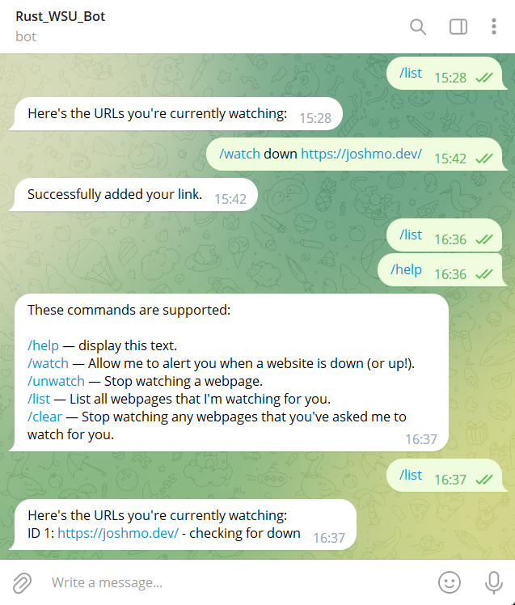

## Rust Telegram Bot
This repo is designed to showcase an example of a Telegram bot created using Rust (with the [Teloxide](https://crates.io/crates/teloxide) crate). 

## Live Deployment
This project is current deployed on the account Rust_WSU_Bot, which you can find [here](http://t.me/Rust_WSU_Bot).

## Usage Pre-requisites
Looking to self-host? This project depends on [shuttle](https://www.shuttle.rs) to be used. You'll need to sign in via Github to get an API key to use in their CLI auth so that you can deploy this project. You will also need a Telegram API Key, which you can find [here](https://core.telegram.org/bots/#how-do-i-create-a-bot). 

## How to Deploy
Clone this repository, then create a `Shuttle.toml` file where you'll set your project name and a `Secrets.toml` file where you'll set your Telegram API token to be able to use Teloxide.

Then simply run `cargo shuttle project new` to initialise your project and `cargo shuttle run` to run in local or `cargo shuttle deploy` to deploy! 

## Dependencies
- Axum: Creating a web server to go with the Bot service.
- Reqwest: Doing http requests to verify if a website is down or up
- shuttle-secrets: Secrets.
- shuttle-service: Enable using shuttle.
- shuttle-shared-db: Enable using shuttle-provisioned DB.
- sqlx: Querying the database.
- teloxide: The whole point of this project (making a Telegram bot).
- tokio: Async, multithreading and some 